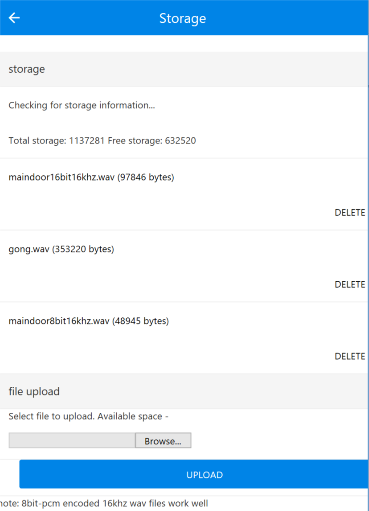
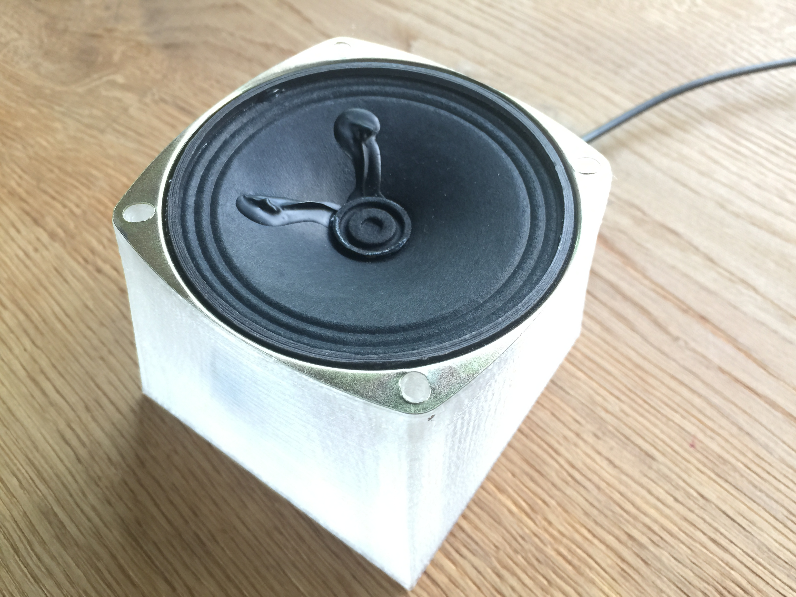
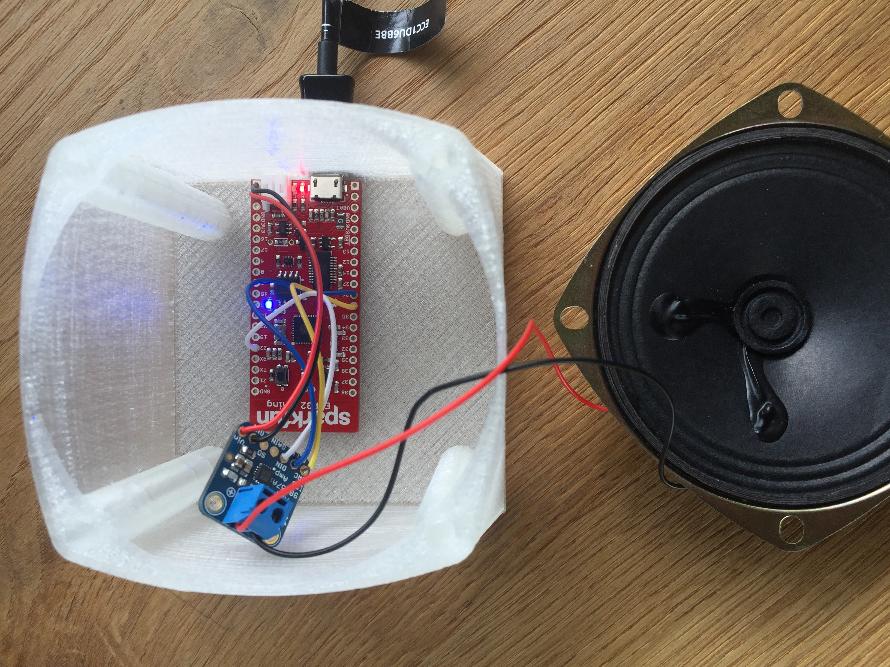

# esp32gong
ESP32 based Gong with embedded webserver, Audio/Sound player, OTA and more - e.g. for Sparkfun thing, Adafruit Huzzah32, and many others

## features
* Webserver with GET/POST, multipart-mime upload and TLS support 
* Webclient with TLS support
* Url/Querystring parser
* Captive webserver in Access Point mode (needs improvement for true captive capabilities)
* Responsive Web UI based on Phonon 1.4.5
* Data embedding (such as HTML, CSS, font files, audio...)
* WAV decoder (e.g. 8 or 16bit mono wav files 16khz work very well, but some other rates work too)
* Audio player to I2S devices (e.g. Adafruit MAX98357A) 
* C++, ESP-IDF
* Wifi AP/STA mode (GPIO0 button will toggle mode)
* Stores config in NVS
* Storage class to wrap SPIFFS read/write access for storing uploaded files on flash on dedicated data partition

todo:
* mp3 support

## screenshots

## build

Updated to ESP-IDF 4.2. Works now also with Visual Code as editor.
Install Python 3.8.x. ESP-IDF 4.2 did fail in visual code with Python 3.9.x.

* Setup ESP-IDF toolchain according to [http://esp-idf.readthedocs.io/en/latest/](http://esp-idf.readthedocs.io/en/latest/)
* run `idf.py menuconfig`
    * adjust flash to 4MB (assuming your ESP32 has at least 4MB flash)
    * change partition setting to custom and choose `partitions.csv`. 
    * Sparkfun thing requires 26Mhz XTAL frequency (vs. 40MHz is default); Huzzah32 work fine at 40MHz
  
## hardware

* SparkFun thing
* [Adafruit MAX98357A](https://www.adafruit.com/product/3006)
* Standard 3" speaker - 4Ohm, 3W e.g. [https://www.adafruit.com/product/1314](https://www.adafruit.com/product/1314)
* 3D printed case - [download model from thingiverse](https://www.thingiverse.com/thing:2562145)

## start

* once your ESP32 is flashed and started the wifi and webserver, it launches an accesspoint called "esp32gong" by default. connect to it and launch http://192.168.4.1/ to configure wifi and upload wav files.

